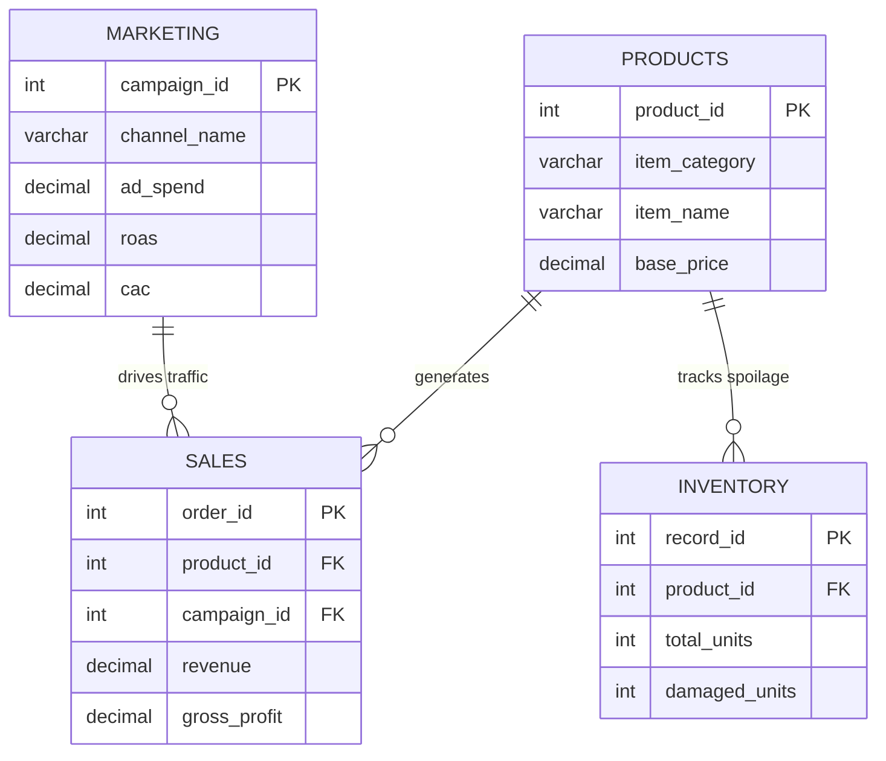
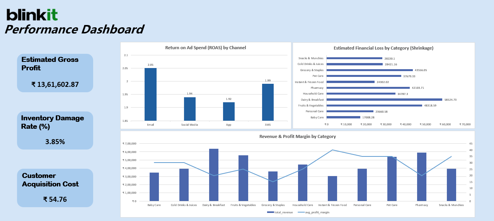

# Quick-Commerce Financial & Operations Analysis (Blinkit Case Study) 2023-2024

## 📌 The Business Problem
To evaluate the financial health of the quick-commerce delivery model, this project uses **Blinkit** as a simulated case study. The executive team requires a consolidated view of operational data to identify which product categories are driving profitability versus which are losing capital due to inventory shrinkage and inefficient marketing spend. The goal is to provide actionable financial insights to improve overall profit margins.

## 💾 The Data & Database Schema
The dataset consists of operational records spanning 2023–2024, tracking product sales, inventory spoilage, and marketing performance. The raw data was modeled in a relational MySQL database to extract structured financial metrics.

## 📊 Results of the Analysis

1. **Revenue vs. Margin:** Dairy & Breakfast categories drive the highest top-line revenue, but suffer from constrained profit margins compared to Pharmacy items.
2. **Inventory Shrinkage:** Calculated a specific % damage rate, revealing that highly perishable items account for the majority of written-off inventory value.
3. **Marketing ROI:** Email marketing proved to be the most capital-efficient channel, delivering the highest Return on Ad Spend (ROAS) and lowest Customer Acquisition Cost (CAC).

## 🛠️ Tech Stack
* **Database Management:** MySQL (Aggregations, Joins, Views)
* **Data Visualization & Analysis:** Advanced Excel (Power Query, Combo Charts, Dynamic KPIs)

## 📂 Project Files
* `Blinkit_SQL_Analysis.sql`: Contains the query logic and view creation for data modeling.
* `Blinkit_Dashboard.xlsx`: The interactive Excel dashboard.
* `Blinkit_Dashboard_Preview.png`: A high-level visual summary of the KPIs.

## 🚧 Limitations & Next Steps
* **Limitations:** The data used is a simulated quick-commerce environment. Real-world external factors such as delivery partner surge pricing, local weather disruptions, and hyper-local competitor promotions were not available for correlation.
* **Next Steps:** Integrate a detailed cost-of-goods-sold (COGS) and warehouse utility dataset to generate a true Net Profit analysis down to the individual dark-store (micro-fulfillment center) level.
